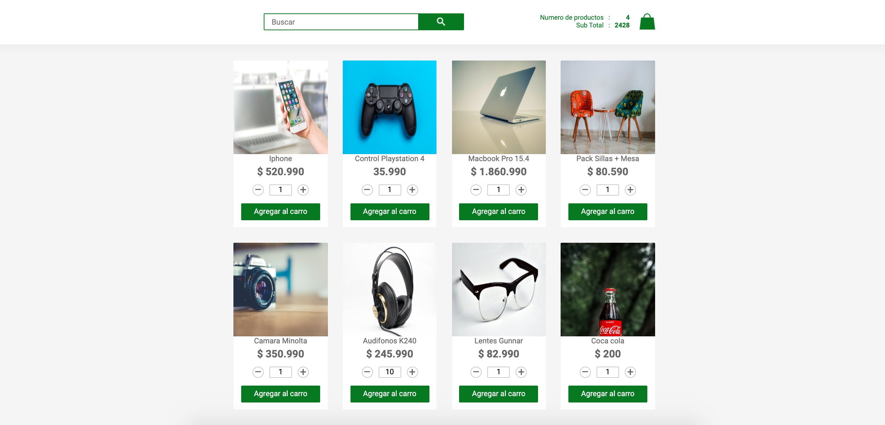
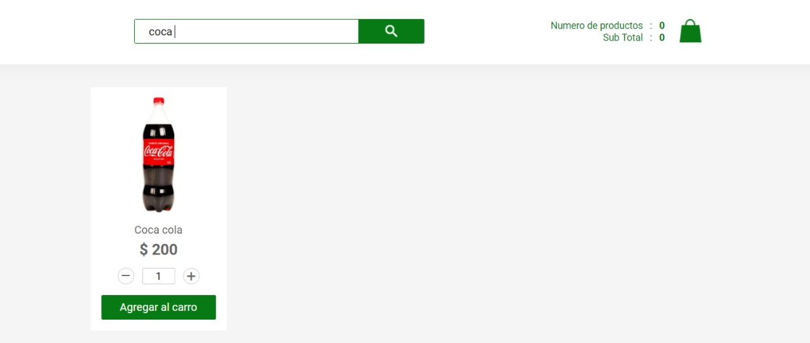
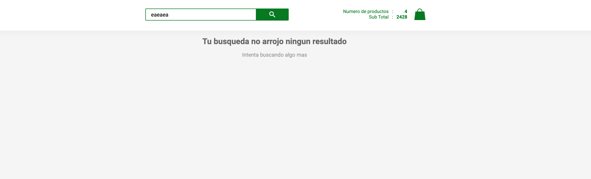

## NU Technology Frontend Test

### 1.- Introducción
La siguiente prueba busca evaluar tus conocimientos en Javascript, React, CSS y HTML

### 2.- Descripción e instalación
Se adjunta un proyecto de nodejs, con una pequeña base de datos y una api ya desarrollada. 

Para ejecutar el proyecto, una vez descargado, hay que ejecutar las siguientes líneas de comandos en el root del proyecto:
```
npm install

node server.js
npm run start
```
Debes correr el servidor de node en una terminal y React en otra

Los requisitos son únicamente tener node con una version mayor o igual a 12.13.0

Si todo funcionó correctamente, va a correr el servidor, y vas a poder acceder a través de cualquier navegador en la dirección: [localhost:3003](http://localhost:3003). Se debería visualizar el html ubicado en `public/index.html`.

### 3.- Desarrollo

El objetivo del test es poder mostrar una lista de productos con cada uno de sus valores como se ve en la siguiente imagen, junto con botones de sumar o restar cantidad y un boton de agregar al carro.

Luego de agregar productos al carro el programa debe poder mostrar un total de productos agregados, ademas del sub-total de todos estos productos (Sumar todos sus valores), como podemos verlo al costado derecho de la imagen.



Ademas de eso hay que implementar un buscador que nos permita poder encontrar el producto del cual escribamos el nombre como se muestra a continuacion:



Tambien en el caso de que no encontremos ningun producto debemos mostrar en pantalla lo siguiente:



### 4.- Descripción de la API
El proyecto incluye la api y la base de datos de almacenamiento. La api es REST, y a continuación se especifican sus métodos:

| Método HTTP   | Ruta           | Descripción  |
| ------------- |:-------------  | -----|
| GET           | /api/products     | Devuelve una lista con todos los productos|
| GET           | /api/products/id |   Devuelve únicamente el producto especificado por el id |

### 5.- Criterios de evaluación
Se pide específicamente el uso de [React](https://facebook.github.io/react/)

Adicionalmente se evaluarán los siguientes puntos:

1. Utilización de patrones, buenas prácticas en el código y arquitectura acorde
2. Documentación en el código
3. Tiempo en realizar la tarea

El diseño es a elección, por lo cual puedes innovar o modificarle el diseño como desees, ya que en si el test busca evaluar tu nivel de ReactJS

Bonos:

- Dará un valor adicional el uso de [Redux](https://redux.js.org). 

### 6.- Plazos y envío
Esta prueba no considera plazos máximos de entrega, pero el tiempo es un criterio de evaluación, por lo que se espera un buen balance entre calidad y el tiempo usado. 

Una vez terminada la tarea, por favor adjuntar el proyecto modificado o subirlo a un repositorio de Github, y enviarlo a:

[jean.vera@nutechnologyinc.com](mailto:jean.vera@nutechnologyinc.com).
